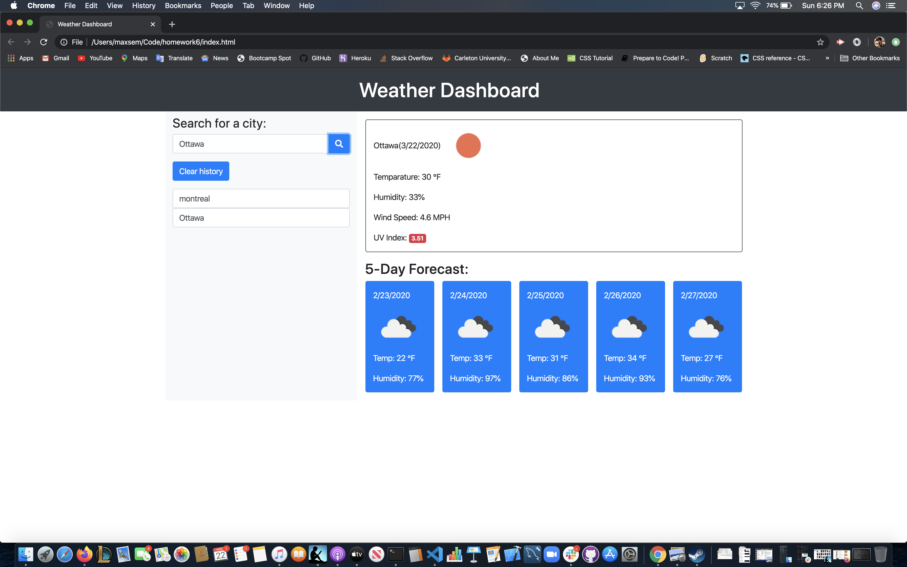

# Weather API

## Table of contents

- Instalation
- Usage
- Credits
- License

## Instalation

Here are the steps to install the repository

1. Clone the repository
2. Pull the repository to make sure you have the most current version
3. Add any changes made
4. Commit your changes and make sure to leave a message of what was done
5. And finally Push the changes up to GitHub once done

## Usage

https://maxsem4.github.io/homework6/

### Thank You for browsing my weather API

## Credit

Credits go out to Carlton University Bootcamp for supplying the idea for the website.

#### Licence

MIT License

Copyright (c) [2020][maxime semegen]

Permission is hereby granted, free of charge, to any person obtaining a copy
of this software and associated documentation files (the "Software"), to deal
in the Software without restriction, including without limitation the rights
to use, copy, modify, merge, publish, distribute, sublicense, and/or sell
copies of the Software, and to permit persons to whom the Software is
furnished to do so, subject to the following conditions:

The above copyright notice and this permission notice shall be included in all
copies or substantial portions of the Software.

THE SOFTWARE IS PROVIDED "AS IS", WITHOUT WARRANTY OF ANY KIND, EXPRESS OR
IMPLIED, INCLUDING BUT NOT LIMITED TO THE WARRANTIES OF MERCHANTABILITY,
FITNESS FOR A PARTICULAR PURPOSE AND NONINFRINGEMENT. IN NO EVENT SHALL THE
AUTHORS OR COPYRIGHT HOLDERS BE LIABLE FOR ANY CLAIM, DAMAGES OR OTHER
LIABILITY, WHETHER IN AN ACTION OF CONTRACT, TORT OR OTHERWISE, ARISING FROM,
OUT OF OR IN CONNECTION WITH THE SOFTWARE OR THE USE OR OTHER DEALINGS IN THE
SOFTWARE.
